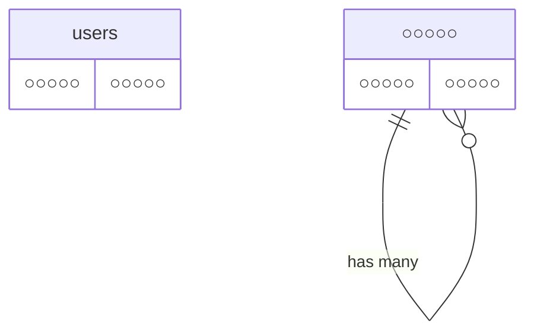

# COACHTECH タスク管理アプリ

○○○○○○ ○○○○○○ ○○○○○○ ○○○○○○ ○○○○○○ ○○○○○○
○○○○○○ ○○○○○○ ○○○○○○ ○○○○○○ ○○○○○○ ○○○○○○

## 作成者

志賀 由美子

## 使用技術

- PHP 8.5
- Laravel
- MySQL 8.4
- phpMyAdmin
- Laravel Sail
- Docker
- Tailwind CSS
- Vite

## ER図



## 開発環境URL

http://localhost

## 動作環境

Docker Desktopを使用したDocker環境で動作します。
Laravel Sailを使用してLaravel、MySQLなどの開発環境を構築しています。
フロントエンドにはViteおよびTailwind CSSを使用しています。

## 環境構築手順

1. **リポジトリをクローン**

```bash
$ git clone https://○○○○○○
```

2. **.envファイルの準備**

`.env.example`をコピーして`.env`を作成します。

```bash
$ cp .env.example .env
```

3. **Composer依存パッケージのインストール**

```bash
$ docker run --rm \
  -u "$(id -u):$(id -g)" \
  -v "$(pwd):/var/www/html" \
  -w /var/www/html \
  -e COMPOSER_CACHE_DIR=/tmp/composer_cache \
  laravelsail/php82-composer:latest \
  composer install --ignore-platform-reqs
```

4. **Laravel Sailの起動**

    Docker Desktopを起動した状態で、Laravel Sailを起動

```bash
$ sail up -d
```

5. **アプリケーションキーの生成**

    Laravelのアプリケーションキーを生成

```bash
$ sail artisan key:generate
```

6. **データベースのマイグレーションと初期データ投入**

    データベースのテーブルを作成します。
    $ sail artisan migrate
    ※初期データをSeederで投入する場合は、以下を実行します。

7. **フロントエンドのビルド**

　 NPM依存パッケージをインストール

```bash
$ sail npm install
```

    Tailwind CSS、PostCSS、Autoprefixerをインストール
    ```bash
    $ sail npm install -D tailwindcss@^3.4.0 postcss autoprefixer
    ```

    開発中はVite開発サーバーを起動したままにしておく（ターミナルを新規で開く）
    ```bash
    $ sail npm run dev
    ```

8. **アプリケーションへのアクセス**

    ブラウザで以下のURLにアクセス
    　　http://localhost

## テスト実行

$ sail artisan test

## 機能一覧

- ○○○○○○ ○○○○○○
- ○○○○○○ ○○○○○○
- ○○○○○○ ○○○○○○
- ○○○○○○ ○○○○○○
- ○○○○○○ ○○○○○○
- ○○○○○○ ○○○○○○

## APIエンドポイント一覧

○○○○○○ ○○○○○○ ○○○○○○ ○○○○○○ ○○○○○○ ○○○○○○ ○○○○○○ ○○○○○○ ○○○○○○

| HTTPメソッド | URI                   | 概要   |
| ------------ | --------------------- | ------ |
| GET          | /○○○○○○/○○○○○○/○○○○○○ | ○○○○○○ |
| GET          | /○○○○○○/○○○○○○/○○○○○○ | ○○○○○○ |
| GET          | /○○○○○○/○○○○○○/○○○○○○ | ○○○○○○ |
| GET          | /○○○○○○/○○○○○○/○○○○○○ | ○○○○○○ |
| GET          | /○○○○○○/○○○○○○/○○○○○○ | ○○○○○○ |
